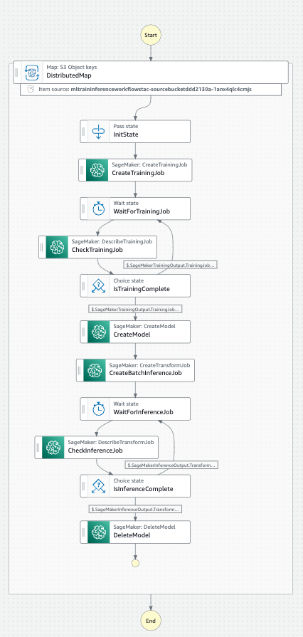

# ML training inference workflow

This example showcases how you can efficiently train and inference a large number of models in one workflow.

## Deployment

```bash
$ cdk deploy
```

## Usage

1. https://eu-west-1.console.aws.amazon.com/states/home (Make sure to select the region of deployment)
2. Open state machine with name like MLTraininingInference*
3. Press "Start execution" at the top right
4. No Input is required

## Workflow Architecture Overview

1. Distributed map, which creates a child workflow for every file in the source bucket. All subsequent steps happen for every file in the bucket
2. Training of a model
3. Waiting for training to finish
4. Saving the model to Sagemaker, to make it available for inference
5. Inference using saved model and data in the target bucket
6. Waiting for inference to finish
7. Deletion of saved model



## Notice

This is a sample solution intended as a starting point and should not be used in a productive setting without thorough analysis and considerations on the user's side.

## Security

See [CONTRIBUTING](CONTRIBUTING.md#security-issue-notifications) for more information.

## License

This library is licensed under the MIT-0 License. See the LICENSE file.

## Attribution

The folder `images/` is based on [this repository](https://github.com/aws/amazon-sagemaker-examples/tree/main/advanced_functionality/scikit_bring_your_own) from [AWS Samples](https://github.com/aws-samples).

